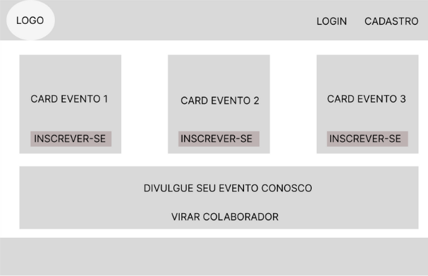
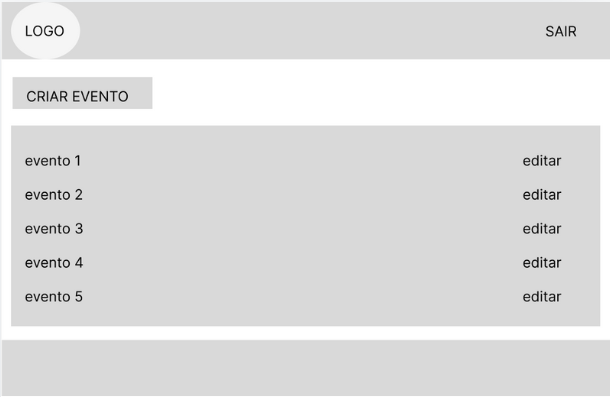
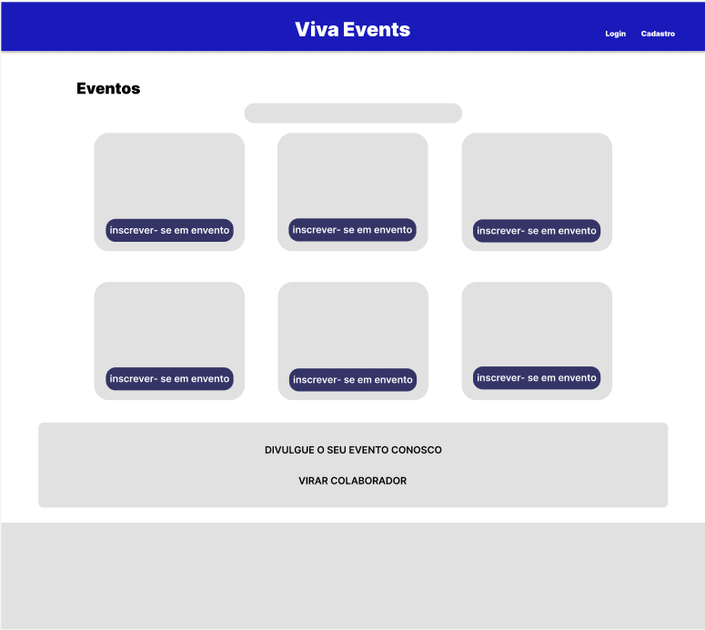
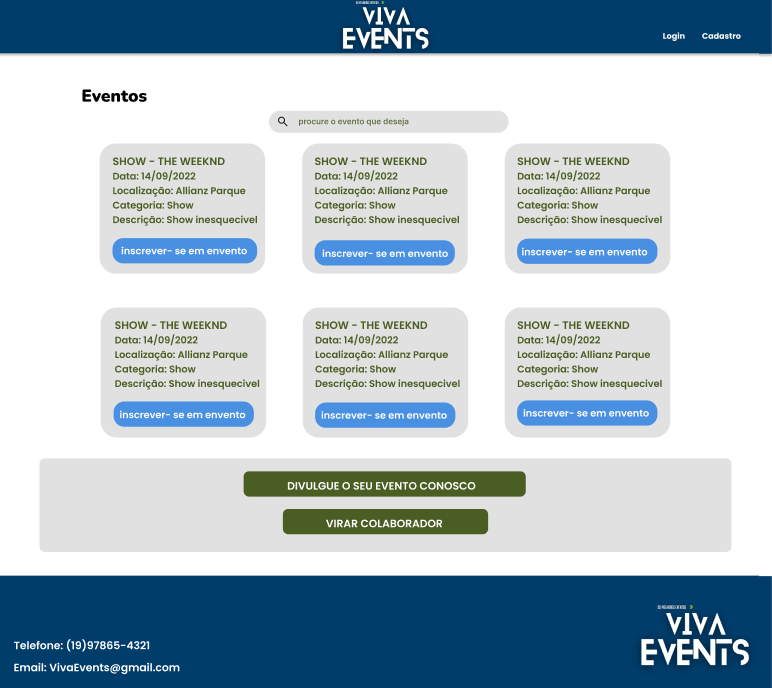

### ESCOPO:
   O Viva Events é uma plataforma digital que facilita a criação, organização e descoberta de eventos. Com uma interface simples e fácil de usar, ajudamos organizadores a planejar e divulgar seus eventos, enquanto permitimos que os visitantes encontrem e acompanhem eventos que eles acham interessantes.
   Para quem organiza eventos, oferecemos ferramentas práticas para criar, gerenciar e promover suas atividades. Já para os visitantes, a plataforma proporciona uma maneira fácil de explorar e se informar sobre shows, palestras e outros eventos, sem precisar se cadastrar.

### OBJETIVOS: 

**Específicos:**
- Desenvolver uma aplicação web para a empresa Viva Events que permita os colaboradores criarem e personalizarem seus eventos;
- Cadastro e Login de visitantes;
- Permitir que os colaboradores gerenciem seus eventos criados, incluindo edições;
- Permitir que os visitantes da página vejam os eventos e façam pesquisas por categoria, data e localização;
- Permitir que os visitantes com login, possam se cadastrar nos eventos.

**Mensuráveis:**
- Garantir que o sistema cadastre até 5 visitantes;
- Garantir que o colaborador cadastre até 10 eventos de diferentes categorias;
- Garantir que um visitante sem login não possa se inscrever em eventos;
- Garantir que visitantes com login possam se inscrever em pelo menos 3 eventos.

**Atingíveis:**
- Utilizar frameworks e bibliotecas bem documentadas (como React, MongoDB, Node.Js, Express) para assegurar o cumprimento dos prazos e qualidade do código.

**Relevantes:**
- Facilitar o processo de criação, divulgação e gerenciamento de eventos.

### CRONOGRAMA:

# ANÁLISE DE RISCOS

## 1. Problemas Técnicos
**Risco:** O sistema pode apresentar lentidão, bugs ou até parar de funcionar, o que pode irritar os usuários.

**Mitigação:**
- Fazer muitos testes antes de lançar a plataforma.
- Monitorar o sistema o tempo todo para identificar e corrigir problemas rapidamente.
- Fazer backup dos dados regularmente e ter um plano para recuperar informações se algo der errado.

## 2. Segurança dos Dados
**Risco:** Dados pessoais e financeiros dos usuários podem ser roubados ou vazados.

**Mitigação:**
- Proteger os dados com criptografia.
- Seguir as regras de proteção de dados, como GDPR e LGPD.
- Fazer revisões regulares de segurança para manter o sistema seguro.

## 3. Engajamento de Usuários
**Risco:** Pode ser difícil atrair e manter organizadores de eventos e visitantes.

**Mitigação:**
- Criar uma boa estratégia de marketing para promover a plataforma.
- Oferecer promoções e parcerias para aumentar a visibilidade.
- Pedir feedback aos usuários e ajustar a plataforma para atender melhor suas necessidades.

## 4. Adoção pelos Organizadores
**Risco:** Se os organizadores de eventos não se interessarem pela plataforma, teremos poucos eventos listados.

**Mitigação:**
- Mostrar aos organizadores como a plataforma pode ser útil para eles.
- Garantir que a plataforma seja fácil de usar.
- Oferecer suporte e orientação para ajudar os organizadores a se familiarizarem com a plataforma.

### RECURSOS:
- React Framework
- Node.js
- Express
- MongoDB Database
- Visual Studio Code
- Excel (Cronograma)
- Miro/Draw.io (Diagramas)
- Figma (Prototipagem)
- Git/GitHub
- Equipe (Gerente de Projeto,Desenvolvedores Backend (2-3 membros),Desenvolvedores Frontend (2 membros),Designer UX/UI,Tester/QA (Controle de Qualidade))

### DIAGRAMAS:

### DIAGRAMA DE USO:

### DIAGRAMA DE FLUXO:

### DIAGRAMA DE CLASSE:

### Prototipagem
### Prototipagem de Baixa Qualidade

### Prototipagem de Média Qualidade

### Prototipagem de Alta Qualidade

### WireFrame de Baixa Fidelidade

